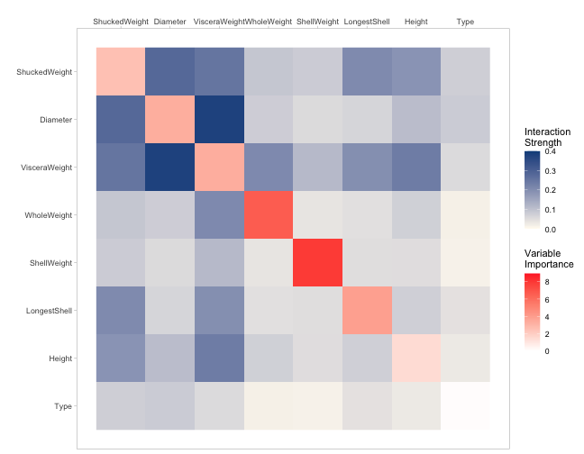
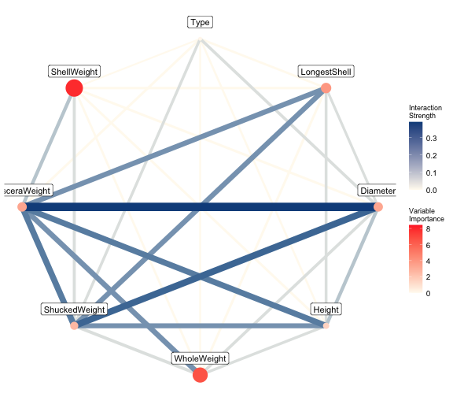
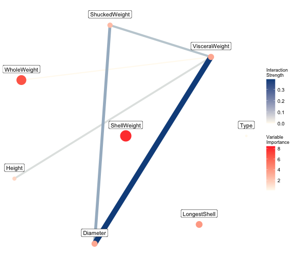
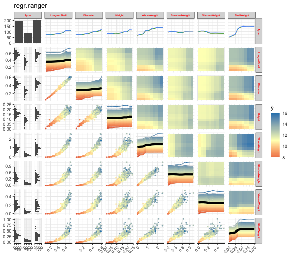
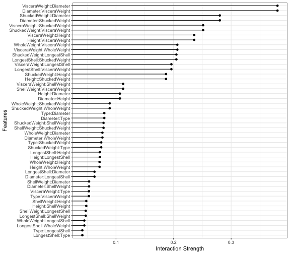
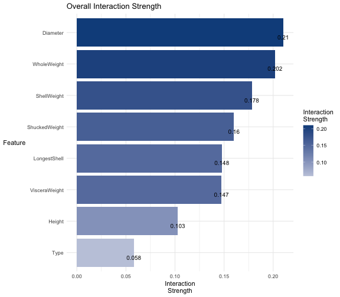
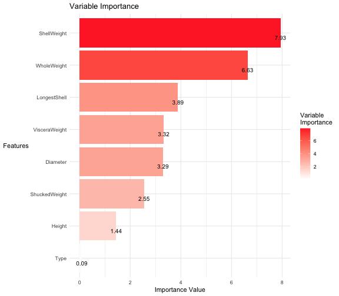

## Introduction

Visualizations can be an important tool for the use of analysis or for the exploration of data. The impact of a carefully chosen visualization can be significant for a researcher, as using a meaningful visualization can give emphasis to the relationships that variables have in a model, and thus serves to help the researcher gain a deeper understanding of the behavior of a model. One such area that can benefit greatly from the use of informative visualizations is that of variable importance and variable interactions. When one creates a machine learning model, a significant challenge that is faced is to visualize the importance of the variables used to train the model and the interactions between these variables and to determine which variables are important and which variables can be cut from the model. Traditional methods of displaying variable importance and variable interactions suffer from a lack of cohesion and imagination. Both  variable  importance  and  variable  interaction  are  clearly  important tools in feature selection, yet traditional visualization techniques deal with them separately

The vivid (variable importance and variable interaction displays) package was designed to help a user to easily distinguish which variables in a model are important and which variables interact with each other in a sensible and interpretable way. vivid contains a suite of plots that enable importance and interaction to be evaluated in a more efficient manor than would traditionally be possible. These include a heat-map style plot that displays 2-way interactions and individual variable importance. Also, a network style plot where the
size of a node represents variable importance (the bigger the node, the
more important the variable) and the edge weight represents the 2-way
interaction strength. Also included is a partial dependence pairs-style plot that displays 2D partial dependence plots, individual ice curves and a scatter-plot, in the one display. The interaction is calculated using *Friedman’s H-Statistic*^[Friedman, H. and Popescu, B.E. Predictive learning via rule ensemble. The Annals of Applied Statistics. 2008. 916-954]

To begin, we load the required packages. `mlr3` and `mlr3learners` will be used to create a `ranger` regression model and the `AppliedPredictiveModeling` package is used to obtain the data. 


```r
library(vivid)
library(mlr3)  # To create a model
library(mlr3learners)
library(AppliedPredictiveModeling) # To get the abalone data
```

## Data used in this vignette:

The data used in the following examples is the *abalone* data from the `AppliedPredictiveModeling` package^[AppliedPredictiveModeling: Functions and Data Sets for 'Applied Predictive Modeling'. M. Kuhn and K. Johnson. 2018. https://CRAN.R-project.org/package=AppliedPredictiveModeling] which contains measurements obtained from 4177 abalones. The data contains measurements of the type (male, female and infant), the longest shell measurement, the diameter, height and whole, shucked, viscera and shell weights. The response variable is rings. The age of the abalone can be determined by counting the rings plus 1.5.
The variables are described as follows:

  - Rings: +1.5 gives the age in years.

  - Longest shell: Longest shell measurement (mm).

  - Diameter: Perpendicular to length (mm).

  - Height: With meat in shell (mm).

  - Whole weight: Whole abalone (gm).

  - Shucked weight: Weight of meat (gm).
  
  - Viscera weight: Gut weight (after bleeding) (gm).
  
  - Shell weight: After being dried (gm).

In all the following examples, a subset of the data is used and *Rings* is used as the response variable.

Load in the data:

```r
data(abalone)
ab <- data.frame(abalone)
ab <- na.omit(ab)
ab <- ab[1:500,]
```

Create an `mlr3` `ranger` model:


```r
set.seed(1701)
ab_task  <- TaskRegr$new(id = "abalone", backend = ab, target = "Rings")
ab_lrn <- lrn("regr.ranger", importance = "permutation")
ab_mod <- ab_lrn$train(ab_task)
```

To begin, we use the `vividMatrix` function from `vivid` to create a symmetrical matrix filled with pair-wise interaction strengths and variable importance on the diagonal. 
The `vividMatrix` uses Friedman's H-Statistic to calculate the pair-wise interaction strength and uses embedded feature selection methods to determine the variable importance. If the supplied learner does not support an embedded variable importance measure, an agnostic approach will be applied to generate the importance values. This function takes in any task, learner and model created from the `mlr3` package and results in a matrix which can be supplied to the plotting functions in the `vivid` package. However, if the user wishes, they can supply their own matrix to plot. The `parallel` argument (default is FALSE) allows the user to run the interaction calculation in parallel.

Create a matrix to be supplied to the plotting functions.


```r
set.seed(1701)
myMatrix <- vividMatrix(task = ab_task, model = ab_mod, remove = FALSE, 
                     percentRemove = 0, parallel = F)
```

As calculating the H-statistic can be a computationally expensive process, the `vividMatrix()` function has the ability to be calculated in parallel (default is `FALSE`). Also, the `remove` argument (default is `FALSE`) will perform a feature selection method and will remove a certain percentage of variables (defined by the user by the `percentRemove` argument) with the lowest interaction strength, and will vastly improve the calculation speed.

Taking a quick look at the created matrix, we can see that it shows the pair-wise interaction strengths for each of the variables, with variable importance on the diagonal.


```r
head(myMatrix, 3)
#>                    Type LongestShell   Diameter     Height WholeWeight ShuckedWeight
#> Type         0.08731989   0.04152462 0.07969863 0.02792620  0.01508732     0.0743219
#> LongestShell 0.04152462   3.88632426 0.06272095 0.07189094  0.04504398     0.2049029
#> Diameter     0.07969863   0.06272095 3.29295981 0.10678777  0.07639781     0.2802981
#>              VisceraWeight ShellWeight
#> Type            0.05299616  0.01318626
#> LongestShell    0.19621383  0.04745800
#> Diameter        0.38048684  0.05319245
```

## Visualizing the results

### Heat-Map style plot

The first visualization option supplied by `vivid` creates a heat-map style plot displaying variable importance on the diagonal and variable interaction on the off-diagonal

**Example**

To call the plot we use the generic `plot()` function with `type = "heatMap"` as follows:


```r
plot(myMatrix, type = "heatMap", plotly = F,
          intLow = "floralwhite", intHigh = "dodgerblue4",
          impLow = "white", impHigh = "firebrick1", 
          minImp = NULL, maxImp = NULL, minInt = 0, maxInt = NULL)
```


<center>
Fig 1.0: *Heat-map style plot displaying 2-way interaction strength in blue and individual variable importance on the diagonal in red.*
</center>

In Figure 1.0, variable importance is placed on the diagonal and is displayed using a gradient of white to red, representing the low to high values of importance. In a similar manner, variable interaction is displayed using a gradient of white to dark blue, representing the low to high values of interaction strength. Plotting both the importance and the interactions from the `vivid` package can save time and minimize complications for a researcher. From the above plot we can see that `Diameter:VisceraWeight` weight has the strongest interaction and `Dianmeter` is the most important variable for predicting `rings`. Traditional visualization techniques are commonly drawn with the order of variables appearing as how they are listed in the data. It has been shown^[ E.Friendly, F. Kwan.   Effect ordering for data displays. Computational Statistics Data Analysis, 43:509–539, 2003.] that reordering the data can help improve visualizations by making them more easily interpreted. The plot in Figure 1.0 also utilizes the `DendSer`^[Catherine B. Hurley and Denise Earle.DendSer: Dendrogram seriation: ordering for visualisation, 2013. R package version 1.0.1] package to _push_ all the relevant values to the top left of the plot. This is done to enable models to be plotted neatly and to allow the user to quickly see which variables are influential in a model.  This is particularly useful for large datasets. 


### Network style plot

Another option supplied by `vivid` is to visualize the variable importance and interactions as a network style plot. This has the advantage of allowing the user to quickly identify which variables have a strong interaction in a model. The importance of the variable is represented by both the size of the node (with larger nodes meaning they have greater importance) and the colour of the node. The importance values are displayed by using a gradient of white to red, representing the low to high values of importance. The two-way interaction strengths between variables are represented by the connecting lines (or edges). Both the size and colour of the edge are used to highlight interaction strength. Thicker lines between variables indicate a greater interaction strength. The interaction strength values are displayed by using a gradient of white to dark blue, representing the low to high values of interaction strength.

**Example**

To call the plot we use the generic `plot()` function with `type = "network"` as follows:


```r
plot(myMatrix, type = "network", thresholdValue = 0, label = FALSE,
            minInt = 0, maxInt = NULL, minImp = 0, maxImp=NULL,
            labelNudge = 0.05, layout = "circle")
```


<center>
Fig 2.0: *Network style plot displaying 2-way interaction strength between each of the variables and individual variable importance*
</center>

From the above plot we can see that `Diameter:VisceraWeight` weight has the strongest interaction and `Diameter` is the most important variable for predicting `rings`. 

The network plot offers multiple possibilities when it comes to displaying the network style plot through use of the `layout` argument. The default layout is a circle but any of the layouts included in the `igraph`/`sna` package are accepted. 

The user can control which interaction values to display by using the `thresholdValue` argument. In the following example, `thresholdValue = 0.2` means that only the the edges with weights (i.e., the interactions) above 0.2 are displayed:


```r
plot(myMatrix, type = "network", thresholdValue = 0.2)
```


<center>
Fig 2.1: *Network style plot displaying thresholded 2-way interaction strengths between each of the variables and individual variable importance. In this plot only the interactions greater than 0.2 are shown.*
</center>

The preceding plots also include options to allow the user to scale the importance/interaction values, through the `minInt, maxInt, minImp, maxImp` arguments. This is particularly useful if one is comparing different fits using the visualizations, as it keeps the values on the same scale. 


### Partial dependence pairs style plot

This function creates a pairs plot style matrix plot of the 2D partial dependence of each of the variables in the upper diagonal, the individual pdp and ice curves on the diagonal and a scatter-plot of the data on the lower diagonal. The partial dependence plot shows the marginal effect one or two features have on the predicted outcome of a machine learning model^[Friedman, Jerome H. “Greedy function approximation: A gradient boosting machine.” Annals of statistics (2001): 1189-1232.]. A partial dependence plot is used to show whether the relationship between the response variable and a feature is linear or more complex.

**Example**


To call the pdp pairs plot we use:

```r
set.seed(1701)
ggpdpPairs(task = ab_task, model =  ab_mod)
#> 
  Calculating pdp + ice...[=========>-------------------------------] 25%. Est: 1s 
  Calculating pdp + ice...[==============>--------------------------] 38%. Est: 1s 
  Calculating pdp + ice...[===================>---------------------] 50%. Est: 1s 
  Calculating pdp + ice...[=========================>---------------] 62%. Est: 1s 
  Calculating pdp + ice...[==============================>----------] 75%. Est: 0s 
  Calculating pdp + ice...[===================================>-----] 88%. Est: 0s 
  Calculating pdp + ice...[=========================================]100%. Est: 0s 
#> 
  Calculating partial dependence...[=>------------------------------]  7%. Est: 9s 
  Calculating partial dependence...[==>-----------------------------] 11%. Est:11s 
  Calculating partial dependence...[====>---------------------------] 14%. Est:12s 
  Calculating partial dependence...[=====>--------------------------] 18%. Est:13s 
  Calculating partial dependence...[======>-------------------------] 21%. Est:12s 
  Calculating partial dependence...[=======>------------------------] 25%. Est:12s 
  Calculating partial dependence...[========>-----------------------] 29%. Est:16s 
  Calculating partial dependence...[=========>----------------------] 32%. Est:18s 
  Calculating partial dependence...[==========>---------------------] 36%. Est:19s 
  Calculating partial dependence...[============>-------------------] 39%. Est:20s 
  Calculating partial dependence...[=============>------------------] 43%. Est:20s 
  Calculating partial dependence...[==============>-----------------] 46%. Est:20s 
  Calculating partial dependence...[===============>----------------] 50%. Est:19s 
  Calculating partial dependence...[================>---------------] 54%. Est:19s 
  Calculating partial dependence...[=================>--------------] 57%. Est:18s 
  Calculating partial dependence...[==================>-------------] 61%. Est:17s 
  Calculating partial dependence...[====================>-----------] 64%. Est:16s 
  Calculating partial dependence...[=====================>----------] 68%. Est:14s 
  Calculating partial dependence...[======================>---------] 71%. Est:13s 
  Calculating partial dependence...[=======================>--------] 75%. Est:12s 
  Calculating partial dependence...[========================>-------] 79%. Est:10s 
  Calculating partial dependence...[=========================>------] 82%. Est: 9s 
  Calculating partial dependence...[==========================>-----] 86%. Est: 7s 
  Calculating partial dependence...[============================>---] 89%. Est: 5s 
  Calculating partial dependence...[=============================>--] 93%. Est: 4s 
  Calculating partial dependence...[==============================>-] 96%. Est: 2s 
  Calculating partial dependence...[================================]100%. Est: 0s
```


<center>
Fig 3.0: *A pairs style matrix plot displaying the partial dependence between each of the variables in the upper diagonal, the individual pdp and ice curves on the diagonal and a scatter-plot on the lower diagonal*
</center>

From the above plot, we see the 2D pdp plots on the upper diagonal. The individual pdp and ice curves on the diagonal (with the aggregate pdp curve in black) and scatter-plots on the lower diagonal. As `type` is a factor variable with 3 levels, a barplot displaying the frequency is displayed on the diagonal and the individual pdp curves are shown on the upper diagonal for this variable. 


In addition to displaying both the variable importance and interactions together, the `vivid` package also allows to display only the variable importance _or_ the interaction strength via the following functions. 

### Displaying all 2-way interactions
The `type = "allInteractions"` plot displays the 2-way interactions on the y-axis and the interaction strength on the x-axis. This plot also allows the user to switch between a lollipop style plot (which is default) and a barplot, by use of the `plotType` argument. 

**Example**
To call the plot we use the generic `plot()` function with `type = "allInteractions"`:

```r
plot(myMatrix, type = "allInteractions", top = 0)
```


<center>
Fig 4.0: *A plot displaying all 2-way interaction in a model.*
</center>

From the above plot we can see that `Diameter:VisceraWeight` has the strongest interaction.

### Display the overall interaction strength

The `interactionPlot()` function creates a plot, displaying the overall interaction strength for each variable in a model. The plot displays the variables on the y-axis and the overall interaction strength on the x-axis. This function also allows the user to switch between a lollipop style plot (which is default) and a barplot, by use of the `type` argument. 

**Example**

To call the interaction plot we use:

```r
interactionPlot(task = ab_task, model =  ab_mod, type = "barplot")
```


<center>
Fig 5.0: *A plot displaying the overall interaction strength for each variable in a model.*
</center>

From the above plot we can see that the variable with the strongest overall interaction strength is `Shell Weight`

## Display the overall variable importance

The `type = "importance"` call creates a plot, displaying the variable importance for each variable in a model. The plot displays variables on the y-axis and the variable importance on the x-axis. This function also allows the user to switch between a lollipop style plot (which is default) and a barplot, by use of the `plotType` argument. 

**Example**

To call the importance plot we use:

```r
plot(myMatrix, type = "importance", plotType = "barplot")
```


<center>
Fig 6.0: *A plot displaying the variable importance for each variable in a model.*
</center>

From the above plot, we can see that the most important variable, when predicting `rings` is `Diameter`.


### Generate data from the Friedman benchmark problem 1 

The `genFriedman()` function simulates data from the Friedman benchmark problem 1^[Friedman, Jerome H. (1991) Multivariate adaptive regression splines. The Annals of Statistics 19 (1), pages 1-67.]. This is mainly used for testing purposes. The output is created according to the formula:


<center>
$$y = 10 sin(π x1 x2) + 20 (x3 - 0.5)^2 + 10 x4 + 5 x5 + e$$
</center>


By default the number of features is set to 10 and the number of samples is set to 100. `sigma` denotes the standard deviation of the noise. `bins` denotes the number of bins to split response variable into. Setting a value greater than 1 turns this into a classification problem where bins determines the number of classes. If the `seed` argument is not NULL, then the random seed will be set as using the function each time will produce different results. 

**Example**

To generate the Friedman data we use:

```r
myData <- genFriedman(noFeatures = 10, noSamples = 100, sigma = 1, bins = NULL, seed = NULL)
head(myData,3)
#>          x1        x2        x3        x4         x5        x6        x7        x8
#> 1 0.1925654 0.4884138 0.1781635 0.8220239 0.02889599 0.4174608 0.2088928 0.3265943
#> 2 0.3501297 0.4496128 0.3948622 0.9966259 0.96126846 0.2840646 0.2247447 0.2916824
#> 3 0.3290067 0.9749012 0.8349866 0.8956613 0.13298507 0.1710446 0.1584246 0.2296050
#>          x9        x10        y
#> 1 0.1251565 0.42608839 13.55727
#> 2 0.7436726 0.07741269 19.31155
#> 3 0.3743393 0.29625462 22.20322
```


