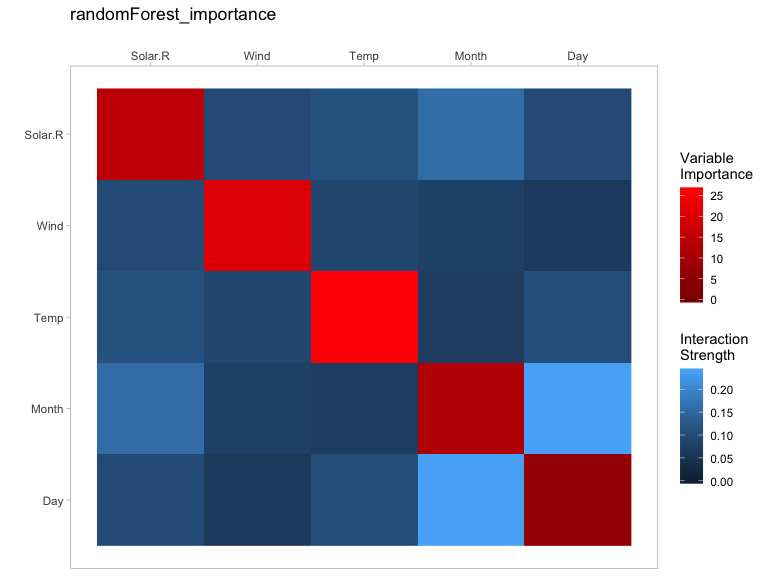
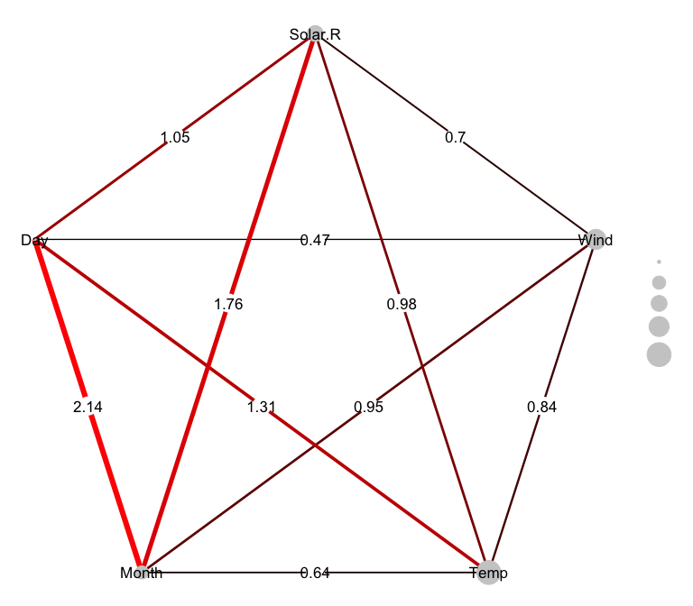
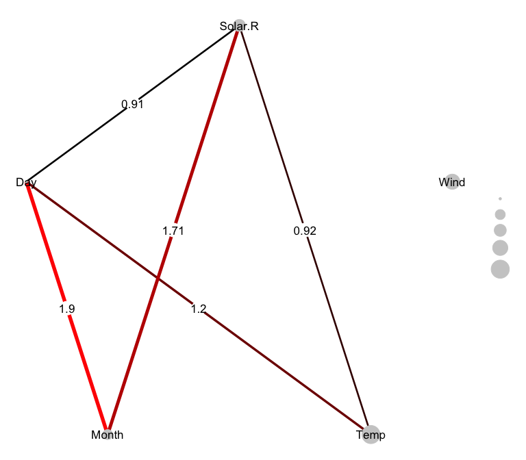
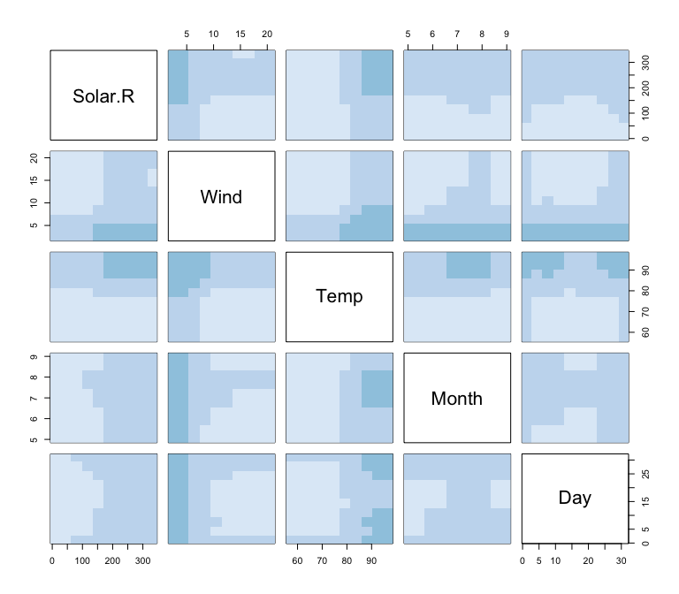

Variable Importance and Variable Interaction Displays (vivid)
================
Alan Inglis, Catherine Hurley, Andrew Parnell
2020-01-28

## Details:

**Type** Package

**Title** vivid

**Version** 0.1.0

**Description** A package for displaying variable importance and two-way
variable interaction on the same plot. Partial dependence plots are also
available in this package.

**Licence** GPL (\>=2)

**Depends**

**Imports**

**Authors** Alan n. Inglis, Catherine Hurley, Andrew Parnell

## Introduction

This package was designed to help a user to easily distinguish which
variables in a model are important and which variables interact with
each other. It does this by giving the user different plotting options.
These include a heatmap style plot that displays 2-way interactions and
individual variable importance. Also, a network style plot where the
size of a node represents variable importance (the bigger the node, the
more important the variable) and the edge weight represents the 2-way
interaction strength. Also included is an option to display partial
dependence plots that utilize an Eularian tour to help the user to
easily identify which variables interact the most. The interaction is
calculated using *Friedman’s H-Statistic*\[1\].

## Data used in this vignette:

The data used in the following examples is the *air quality* data which
is the daily air quality measurements in New York, May to September
1973\[2\]. The data contains 6 variables which are described as follows:

  - Ozone: Mean ozone in parts per billion from 1300 to 1500 hours at
    Roosevelt Island.

  - Solar.R: Solar radiation in Langleys in the frequency band 4000–7700
    Angstroms from 0800 to 1200 hours at Central Park.

  - Wind: Average wind speed in miles per hour at 0700 and 1000 hours at
    LaGuardia Airport.

  - Temp: Maximum daily temperature in degrees Fahrenheit at La Guardia
    Airport.

  - Month: The month the data was recorded (takes a value between 1-12).

  - Day: The day the the data was recorded (takes a value between 1-7).

In all the following examples, *Ozone* is used as the response variable.

## Commands:

# intHeatmap()

-----

*Create a Heatmap style plot displaying Variable Importance and Variable
Interaction*

-----

**Description**

Plots a heatmap of the interaction strength with variable importance on
the off-diagonal

**Usage**

intHeatmap(task, model, method, interact)

**Arguments**

  - task - Task created from the `mlr` package (either regression or
    classification).

  - model - Any machine learning model.

  - method - A list of variable importance methods to be set by the
    user. These can include any of the importance methods contained
    within the `mlr` package. The default is method = randomForest.

  - interact - If interact = TRUE, an interactive plotly object is
    displayed where the user can hover the mouse icon over any part of
    the plot and a text box will appear displaying information related
    to the selected
variables.

**Examples**

``` r
# Get data ----------------------------------------------------------------
## Air quality data (used for regression)

aq <- data.frame(airquality)
aq <- na.omit(aq)

# mlr set up --------------------------------------------------------------

aqRgrTask  <- makeRegrTask(data = aq, target = "Ozone")
aq.regr.lrn <- makeLearner("regr.randomForest")
aqMod <- train(aq.regr.lrn, aqRgrTask)
```

To call the plot we use the `intHeatmap()` command as follows:

``` r
# Plot Heatmap
intHeatmap(aqRgrTask, aqMod, method = "randomForest_importance", interact = F)
```

<!-- -->

<center>

Fig 1.0: *Heatmap style plot displaying 2-way interaction strength in
blue and individual variable importance on the diagonal in red.*

</center>

From the above plot, the user can easily see that *Temp* is the most
important variable when preidicting *Ozone*. Also, there is a clear and
strong interaction between *Month* and *Day*.

# importanceNet():

-----

*Create a Network style plot displaying Variable Importance and Variable
Interaction*

-----

**Description**

Plots a network style graph, where node size represents variable
importance and edge width and colour represents interaction strength.
The edge colour is displayed as a gradient from black to red. Black
represents a weak interaction, whereas red displayes stronger
interactions.

**Usage**

importanceNet(task, model, method, Threshold, ThresholdValue, Cluster)

**Arguments**

  - task - Task created from the `mlr` package (either regression or
    classification).

  - model - Any machine learning model.

  - method - A list of variable importance methods to be set by the
    user. These can include any of the importance methods contained
    within the `mlr` package. The default is method = randomForest.

  - Threhold - If Threshold = TRUE then only the strongest interactions
    are displayed.

  - ThresholdValue - This values detremines the amount of edges to
    display.

  - Cluster - If Cluster = TRUE then the data is clustered according to
    interactions.

**Examples**

To call the plot we use the `imprtanceNet()` command as follows:

``` r
set.seed(1701)
importanceNet(aqRgrTask, aqMod, method = "randomForest_importance", Threshold = F, Cluster = F)
```

<!-- -->

<center>

Fig 2.0: *Network style plot displaying 2-way interaction strength
between each of the variables and individual variable importance*

</center>

The edge width, in the above plot, indicates the interaction strength,
with the actual value displayed in the centre of of the edges. The
colour of the edges also visually represents the interaction strength
through use a of colour gradient, with low values being in black and
high values being in red.

The node size represents individual varialbe importance with respect to
predicting the response.

As can be seen in the above plot, *Month* and *Day* have the largest
interaction and *Temp* is the most important variable for predicting
*Ozone*.

If `Threshold = TRUE` then only the strongest interactions are
displayed. The amount of edges can be decided by the user using the
`ThresholdValue` argument. In the following example, `ThresholdValue
= 3` means that only the top 3 strongest interactions are displayed.:

``` r
set.seed(1701)
importanceNet(aqRgrTask, aqMod, method = "randomForest_importance", Threshold = T, 
                                ThresholdValue = 3, Cluster = F)
```

<!-- -->

<center>

Fig 2.1: *Network style plot displaying thresholded 2-way interaction
strengths between each of the variables and individual variable
importance. In this plot the top 3 strongest interactions are displayed*

</center>

# PDPpairs():

-----

*Creates a plot of the partial dependence of each of the variables in
pairs plot style matrix*

-----

<!-- -->

<center>

Fig 3.0: *A pairs style matrix plot displaying the partial dependence
between each of the variables*

</center>

1.  H. Friedman and B.E. Popescu. Predictive learning via rule ensemble.
    The Annals of Applied Statistics,, pages 916–954, 2008.

2.  Chambers, J. M., Cleveland, W. S., Kleiner, B. and Tukey, P. A.
    (1983) Graphical Methods for Data Analysis. Belmont, CA: Wadsworth.
